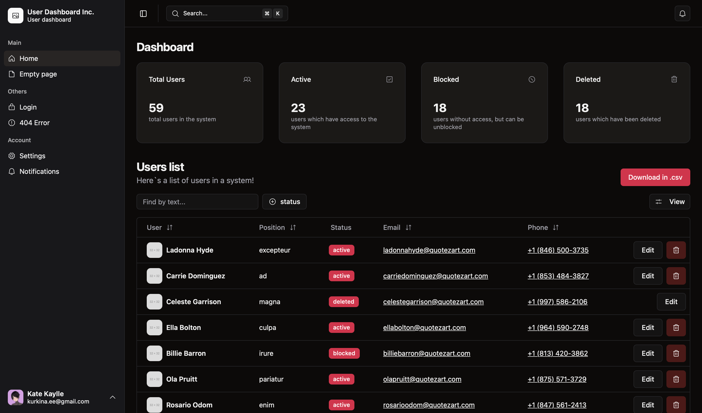
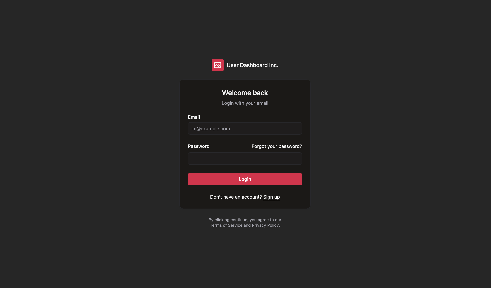
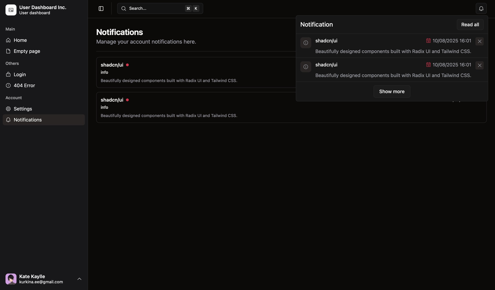

# User Dashboard Project

A modern **User Dashboard** built with **Vue 3**, **TypeScript**, **Vite**, and **shadcn/ui**.  
This project provides a responsive admin interface to manage users, customize themes, and visualize user statistics.

---

## Login and Password

Login: kurkina.ee@gmail.com

Password: 1234

## Features

- **User Management Table**: View, edit, and manage users.
- **Theme Settings**: Light and dark mode toggle for better UX.
- **Notifications Layout**: Structured list of notifications for users.
- **Account Settings**: Update personal info and preferences.
- **Statistics Cards**: Display key user statistics in a clean dashboard format.
- **404 Page**: Friendly and responsive error page.
- **Reusable UI Components**: Modular components for cards, tables, dialogs, and more.

---

## Screenshots





---

## Technologies Used

- **Vue 3** – Frontend framework.
- **TypeScript** – Strong typing for safer and cleaner code.
- **Vite** – Fast development and build tooling.
- **shadcn/ui** – Prebuilt components for UI.
- **CSS / Tailwind** – Styling and responsive design.

---

## Project Setup

```bash
# Install dependencies
npm install

# Run development server
npm run dev

# Type checking
npm run type-check

# Build for production
npm run build
```
## Folder Structure

```bash
src/
├─ components/      # Reusable UI components (cards, tables, dialogs, etc.)
├─ views/           # Pages (Dashboard, Account Settings, 404)
├─ layouts/         # Layouts (main app layout)
├─ lib/             # Utility functions
├─ assets/          # Images, icons, and other static files
├─ store/           # State management (if used)
├─ router/          # Vue Router configuration
```

## Future Improvements

 - Add user filtering and search functionality in the table.
 - Implement role-based access control for different users.
 - Add interactive charts for advanced analytics.
 - Integrate a real backend API for dynamic data.

## License
MIT License